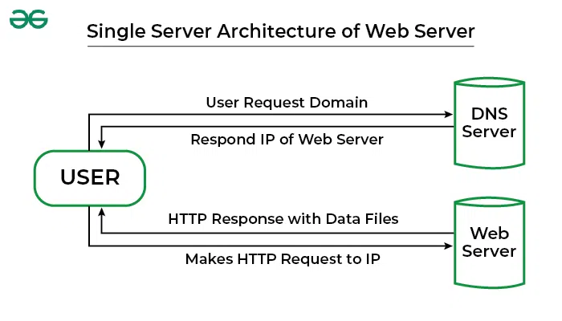

> MSA 구조가 자주 언급되지만, 정작 그 이전의 모놀리식이 실제로 어떤 구조였기에
> MSA가 필요했는지 감이 잘 안 올 때가 있음.
>
> 그래서 대학 정보시스템을 예로 들어, 과거에 흔했던 모놀리식 프로젝트 구조를 정리해봄.

# 학생정보 System 관리 프로젝트

## 1. 모놀리식 시스템의 일반적인 구성 요소

1. Web UI (JSP / Thymeleaf / Spring MVC / ASP.NET / PHP 등)
2. Back-end Application (하나의 큰 서버: Spring, Java EE, .NET…)
3. DB 1~2개 (Oracle / MS-SQL / MySQL)
4. Batch 서버 (있을 수도 있고 없음)
5. 파일서버 (증명서 PDF, 이미지 저장)

## 2. 프로젝트 디렉토리 구조 예시

모놀리식이라, 한프로젝트에 모든기능이 다 들어감

```
/university-system
 ├── student         # 학생 관리
 ├── professor       # 교수 관리
 ├── course          # 강의/수강관리
 ├── grade           # 성적/이수관리
 ├── auth            # 로그인/권한/SSO
 ├── admin           # 학적/등록/졸업 관리
 ├── certificate     # 제증명 발급
 ├── common          # 공통 유틸/로그/인터셉터
 └── resources       # 프로젝트 세팅
```

> 디렉토리 구조만 보면 도메인이 나눠져 있어 모듈화처럼 보이지만,
>
> 실제로는 모든 코드가 하나의 빌드 결과물(`.war`/`.jar`)에 포함되어 한 덩어리로 배포됨.
>
> 즉, “구조만 모듈형이지 실제 동작은 모놀리식”인 전형적인 형태.

## 3. 인프라 구성 예시

### case a. 단일 서버 + 단일 DB



가장 흔한 형태:

- 서버가 죽으면 전체 다운
- API·배치·관리자 화면 모두 같은 인스턴스에서 실행
- WAS 로그가 섞여 문제 추적 어려움
- 1개의 스레드 풀을 모두가 공유함 → 특정 기능이 과도한 부하를 주면 전체 병목

### case b. 웹서버 + WAS 분리

```
[Client]
   ↓
[Web Server]  → 정적 파일, 로드밸런싱
   ↓
[WAS Server]  → Java/Spring 앱
   ↓
[Oracle DB]
```

Apache + Tomcat 조합을 주로 사용했었음

~(아니면.. zeus ?)~

## 4. 배포방식

**✔ WAR 파일로 묶어서 Tomcat에 직접 올림**

```bash
/usr/local/tomcat/webapps/univ-system.war
```

배포 자동화? 거의 없고, 수동으로 하거나, 자체솔루션으로 처리하는경우가 다수

1. 담당개발자가 build 스크립트 실행하거나, 자체 솔루션으로 build 진행
2. 빌드후 만들어진 `.jar` or `.war` 파일을 교체
3. Tomcat or WAS server 재구동
4. 사용시간이 많은 시간대 진행하지 않고, 일찍출근해서 진행하거나, 좀 업무시간이 별로없는 시간대에 진행

## 5. 데이터 설계

```
- STUDENT
- PROFESSOR
- COURSE
- LECTURE
- ENROLLMENT
- GRADE
- DEPARTMENT
- TUITION
- ATTENDANCE
- CERTIFICATE_ISSUE_LOG
```

각 도메인들 포함해서 테이블이 200~400개 정도 가량된다고 보면된다.
그리고 db로 작성한 스크립트 `PL/SQL` 이 상당히 많음

## 6. 인증 / 권한 구조

- 세션 기반 인증
- `Spring Security` 이전의 `Filter + Session + Cookie` 방식일 가능성이 높음 (지금은 거의 없지 않을까 ..)
- 교수 / 학생 / 조교 / 교직원 권한을 한 시스템에서 구분
- 메뉴별 접근권한을 DB에 저장하고, 매 요청 시 체크하는 구조

## 7. 강의계획서 / 성적 / 수강신청은 모두 한 시스템에서 처리

모놀리식이라 모든 기능이 한 서버에 있음:

- 학생 정보 조회
- 교수 강좌 관리
- 성적 입력
- 출석 관리
- 수강신청
- 장학금 신청
- 등록금 납부
- 졸업요건 계산

**전부 한 어플리케이션 내의 Controller + Service + DAO가 처리.**

## 8. 배치(batch) 구조

- 밤 12시에 **이수구분 계산**
- 성적 정산
- 장학금 선정 처리
- 출석 통계
- 증명서 발급 로그 백업

> 많은 대학 시스템에서는 `Java` 배치보다 DB 내부의 `PL/SQL` 프로시저를 직접 호출하는 형태가 흔했음.
>
> 배치는 `cron + shell script + SQL` 호출 조합으로 구현되는 경우가 많았음.

## 9. 모놀리식 구조의 특징 (장점/단점)

**장점**

- 개발 난이도가 낮음
- DB 트랜잭션 관리 쉬움
- 배포 구조 단순
- 유지보수 인원 적어도 운영 가능

**단점**

- 한 기능이 장애나면 전체 서비스 영향
- 확장이 어려움(서버 한 대만 로드 증가)
- 코드가 비대해져 관리가 어려움
- 교수·학생·행정 서비스가 뒤엉켜 결합도가 높음
- 배포 시 전체 다운타임 발생
- 기능 분리 불가능(모듈화 안 됨)
