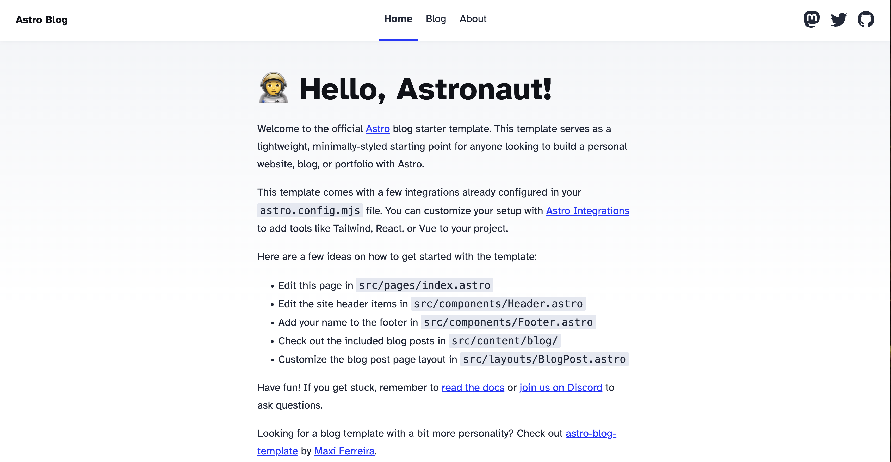

사실 예전에 `Jekyll` 기반 블로그를 운영한 적이 있었는데, <br/>
Ruby 기반이라는 점과 테마 커스터마이징의 부담 때문에 조금 쓰다 자연스럽게 유기하게 되었음 ㅠ <br/>
~~루비야 미안해~~

그러다 chatgpt 에게 요즘은 블로그 뭐로 만드냐 추천좀 해줘라 라고 물으니, 나온게 `astro` 였음

## 1. what is astro ?

[링크](https://astro.build/) 에 들어가보면 대문짝만하게 아래와 같이 소개하고 있다

The web framework for content-driven websites<br/>
Astro powers the world's fastest marketing sites, blogs, e-commerce websites, and more.

웹 컨텐츠 중심의 프레임워크 <br/>
Astro는 세계에서 가장 빠른 마케팅 사이트, 블로그, 전자상거래 웹사이트 등을 지원합니다.

아무래도 javascript, typescript를 베이스로 하고<br/>
react, vue 등등 frontend가 익숙한 사람들에게는 아마 이 프레임워크가 엄청 친숙하게 다가오지 않을까 하는 생각에 시작했음<br/>

## 2. 친절한 Docs, 언어의 친숙함에서 오는 낮은 러닝커브

일단 공식문서 [docs](https://docs.astro.build/ko/getting-started/)가 **한글지원**이 된다

개발자라면 그래도 익숙할? 익숙해진? `javascript/typescript` 기반으로 작성되는 코드

그리고 Next나 Nuxt를 해본사람은 익숙할 src/pages/ 디렉터리의 파일 레이아웃을 기반으로 빌드 URL을 생성하기 위해 파일 기반 라우팅을 지원함

그리고 Nuxt, Vue 에서 볼 수 있는 `slot` 이것도, Astro 에서 자주 사용됨

## 3. Jekyll 에서 Astro로 변경한 이유

간단하다 코드가 매우 익숙하기 때문에

### 3-1. Jekyll을 사용하면서 불편했던점

- Ruby 라는 언어 + 테마 수정에 대한 어려움 <br/>
  나는 블로그를 만들고 `markdown`만 작성해서 블로그를 운영하고 싶은건데 커스터마이징 한다고 코드건드려야되면, 자연스럽게 Ruby에 대한 숙련도가 적어서 Ruby 숙련도를 자연스럽게 올려야 하는, 테마를 약간씩 조정하고 싶을때 이부분이 조금 힘들었음, 글을 쓰려다 목적이 바뀌어버린듯한 느낌을 받았음

### 3-2. Astro로 변경하고 나서 좋았던점

- javascript, typescript 기반이라 수정하기가 쉬웠음(숙련도가 어느정도 있다보니)
- 페이지를 Component화 하여 관리할 수 있었음(React, Vue 처럼)
- 커스터마이징이 재밌어 졌음

## 4. Astro 프로젝트 초기 세팅 과정

**2025.12.15 기준**

- Node version : `v18.20.8` 또는 `v20.3.0`, `v22.0.0 이상` (v19 및 v21은 지원되지 않음)
- Vscode Install
- [세팅 가이드 링크](https://docs.astro.build/ko/install-and-setup/)

### 4-1. 프로젝트 설치

```bash
npm create astro@latest
```

위 명령어를 친 후, 아래와 같이 진행하면된다

> Where should we create your new project? -> github-pages or [your github name].github.io<br/>
> How would you like to start your new project? -> Use blog template <br>
> Install Dependency -> Yes <br/>
> Initialize a new git repository -> Yes

### 4-2. 설치 종료 및 실행결과



## 5. 파일 및 디렉터리 구조

```
.
├─ .astro/                  # Astro 내부 캐시 및 빌드 메타데이터 (직접 수정 X)
├─ .vscode/                 # VS Code 전용 설정 (포맷터, 추천 확장 등)
├─ node_modules/            # 설치된 의존성 패키지들
├─ public/                  # 빌드 없이 그대로 배포되는 정적 파일
│   └─ favicon.svg          # 파비콘, og 이미지, 로고 등
│
├─ src/                     # 실제 개발 소스 루트
│   ├─ assets/              # 빌드 과정에 포함되는 이미지·폰트 등 리소스
│   │                         (import 해서 사용하는 정적 자원)
│   │
│   ├─ components/          # 재사용 가능한 UI 컴포넌트
│   │                         (Header, Footer, ThemeToggle 등)
│   │
│   ├─ content/
│   │   └─ blog/            # 블로그 글(md/mdx)이 위치하는 Content Collection
│   │                         (각 파일이 하나의 게시글)
│   │
│   ├─ layouts/             # 페이지 공통 레이아웃 정의
│   │                         (헤더/푸터 + <slot /> 구조)
│   │
│   ├─ pages/               # URL과 1:1로 매핑되는 페이지 라우트
│   │   ├─ index.astro      # 메인 페이지 (/)
│   │   └─ blog/
│   │       └─ [slug].astro # 블로그 상세 페이지 (/blog/글-slug)
│   │
│   ├─ styles/              # 전역 스타일 및 테마 관련 CSS
│   │                         (global.css, theme.css 등)
│   │
│   ├─ consts.ts            # 사이트 전역에서 사용하는 상수 모음
│   │                         (사이트 제목, 설명 등)
│   │
│   └─ content.config.ts    # Content Collection 스키마 정의
│                             (게시글 메타데이터 구조 검증)
│
├─ astro.config.mjs         # Astro 프로젝트 전체 설정 파일
├─ package.json             # 의존성 및 스크립트 정의
├─ package-lock.json        # 의존성 고정(lock) 파일
├─ tsconfig.json            # TypeScript 설정
└─ README.md                # 프로젝트 설명 문서
```

> Astro 블로그 템플릿은 content/blog에 글을 작성하고, <br/>
> Next, Nuxt로 익숙해진 pages 폴더에서 라우팅을 정의하며, <br/>
> components와 layouts로 UI 구조를 분리하는 방식으로 구성되어 있다.

## 6. Astro를 사용하면서 좋았던점, 안좋았던점

- **좋았던점**
  1. Pages/ 기반의 라우팅이 편리했음
  2. markdown에 상단에 `frontmatter`를 작성하여 markdown을 사용하면서 응용을 하기 편했다 (ex. tag별 모아보기, series를 기술하여, 시리즈별로 보기, 차후 기능추가예정이지만, 카테고리별로 글을 본다던지)
  3. 가볍게 프론트엔드를 맛보기에도 괜찮은 프레임워크 같았음 (page router, layout, component 분리)
  4. 기본적으로 정적 HTML 기반이라 구조를 이해하기 쉬웠고, 필요한 컴포넌트만 client-side로 동작시키는 방식이 인상적이었다.

- **안좋았던점 or 아쉬운점**
  1. 아무래도 정적방식(SSG Static Site Generation) 이다보니, QueryString, 페이징처리, 첫페이지에 포스트 4개정도 가져와서 보여줘야 하는데 어려워서(~하긴했음..~) 이런게 **"아 이게 왜안돼"** 이런느낌이 많이 들었다
  2. 정적인 사이트에 좋아요, 댓글을 고민하니까 **"아, 이거 좀 아쉽네"** 라는 생각
  3. 기술적인 갈망이 들때마다 **정적사이트를 위한 프레임워크**였다는거에 아쉬움이 살짝살짝씩 있음
  4. 생태계가 적었다는점(한국에선 모르겠는데 중국쪽은 자료가 그래도 어느정도 있었다라는, 블로그도 괜찮게 나온 템플릿 들도 중국에서 만든게 많았고)

## 7. 결론

가볍게? Docs형태의 사이트를 만들고 싶었다, 라고 한다면 추천해볼만하다.<br/>
그렇지만, 블로그지만 Web Application을 고민하고 있다라고 하면 추천하진 않음<br/>

개인적으로는 Astro를 `JS/TS 기반으로 다시 설계된 Jekyll` 에 가깝게 느꼈음<br/>

만약 Astro에서 한계를 느낄거같다. <br/>
라고한다면 Next, Nuxt로 페이지만들고, `Vercel`로 배포 하는걸 알아보는게 편할것 같다
