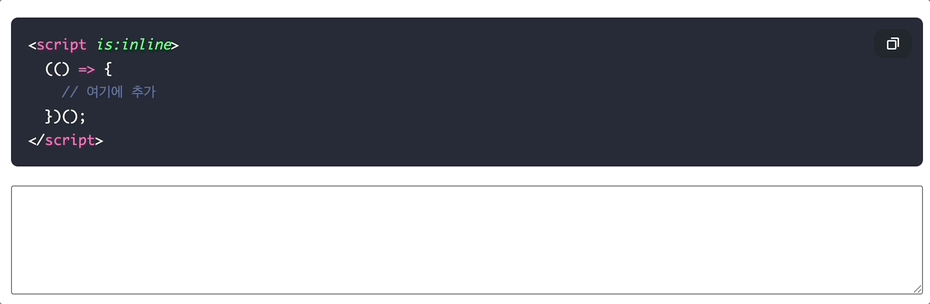

import { baseUrl } from "@/constants";
import DownloadCard from "@/components/posts/DownloadCard.astro";

## 1. 내 블로그도 복붙 버튼 만들고 싶어 ..

여느 블로그를 보면, 코드블럭에 복사 + 붙여넣기를 하기좋게 버튼들이 있는데,
제로베이스의 내 블로그를 보면 그 기능이 없어서 찾아본결과 직접만들거나, 라이브러리를 추가해야하는것 정도였다

`rehype-pretty-code` 를 이용하면 금방 한다는데, 그건 다음 글에서 다뤄보기로 하고, <br/> 이번글에서는 직접 `astro` + `vanilla js` 로 만들어보는법을 다뤄보겠다

## 2. 이미지 준비

말그대로 copy + complete에 사용할 이미지들을 svg 코드로 만들어놨다 아래처럼

```ts
const copyIcon = `
          <svg aria-hidden="true" focusable="false" class="icon" viewBox="0 0 24 24">
            <path d="M9 3h10a2 2 0 0 1 2 2v12h-2V5H9V3Zm-4 4h10a2 2 0 0 1 2 2v10a2 2 0 0 1-2 2H5a2 2 0 0 1-2-2V9a2 2 0 0 1 2-2Zm0 2v10h10V9H5Z" fill="currentColor"/>
          </svg>`;
const checkIcon = `
          <svg aria-hidden="true" focusable="false" class="icon" viewBox="0 0 24 24">
            <path d="m9.6 16.2-3.8-3.8 1.4-1.4 2.4 2.4 7.2-7.2 1.4 1.4-8.6 8.6Z" fill="currentColor"/>
          </svg>`;
```

**주의할점** <br/>
`astro` 의 경우 동적으로 생성되는 코드들은 css가 먹혀지지 않아서, <br/>
`:global()` 이라는 선택자를 사용하여 css 스타일을 적용해야 한다는점이 있음

## 3. 코드블록안에 copy 버튼을 붙여보자

일단 소스코드를 markdown이 변환된 페이지의 소스코드를 까보면 markdown에서 \`\`\` 으로 사용한 코드들은 <br/> html 코드로 변환되었을때, `pre > code` 안에 있다는것을 확인 할 수 있어서 스크립트내부에서 아래처럼 조회가 가능함

```ts
const codeBlocks = Array.from(document.querySelectorAll("pre > code"));
if (!codeBlocks.length) return;
```

조회가 되었다면, 렌더링된 `code block` 들을 순회하면서, 아래의 로직을 수행함

```ts
codeBlocks.forEach((codeEl) => {
    // 1. 부모 element에 접근
    const pre = codeEl.parentElement;

    // 2. 복사버튼이 있는지 확인, 있으면 함수를 종료
    if (!pre || pre.querySelector(".code-copy")) return;

    // 3. 동적으로 button을 생성, 위의 copyIcon 을 붙여서
    const btn = document.createElement("button");
    btn.type = "button";
    btn.className = "code-copy";
    btn.innerHTML = `${copyIcon}<span class="sr-only">코드 복사</span>`;
    btn.setAttribute("aria-label", "코드 복사");

    // 4. 동적으로 만들어진 button에 이벤트 부여
    btn.addEventListener('click', async () => {
        // 4-1. code block의 텍스트를 추출
        const text = codeEl.innerText;

        try{
            // 4-2. clip-board에 code-block text를 복사, 복사완료
            await navigator.clipboard.writeText(text);
            btn.innerHTML = `${checkIcon}<span class="sr-only">복사 완료</span>`;
            btn.classList.add("copied");
        }catch (err) {
            // 클립보드 API를 사용할 수 없거나 복사에 실패한 경우
            btn.innerHTML = `${copyIcon}<span class="sr-only">복사 실패</span>`;
            console.error("Copy failed", err);
        }finally {
            // 4-3. setTimeout의 두번째 인자대로 1.4초후, 원래상태로 되돌아감
            setTimeout(() => {
                btn.innerHTML = `${copyIcon}<span class="sr-only">코드 복사</span>`;
                btn.classList.remove("copied");
            }, 1400);
        }
    });

    // 5. pre에 해당 이벤트를 붙여넣는다
    pre.appendChild(btn);
}
```

## 4. 함수는 즉시실행함수(IIFE)로 감싸서 사용

2번부터 3번의 과정은 body의 끝에서, 즉시실행 함수로 감싸서 사용한다

```html
<script is:inline>
  (() => {
    // 여기에 추가
  })();
</script>
```

## 5. code-block styles

```css
:global(pre[data-code-block]) {
  position: relative;
}

:global(pre[data-code-block] .code-copy) {
  position: absolute;
  top: 10px;
  right: 10px;
  padding: 6px 10px;
  border-radius: 10px;
  border: 1px solid #24292e;
  background: #24292e;
  color: #ffffff;
  cursor: pointer;
  font-size: 0.85rem;
  line-height: 1;
  box-shadow: 0 10px 24px var(--shadow);
  transition:
    transform 0.15s ease,
    box-shadow 0.2s ease,
    background 0.2s ease;
  display: inline-flex;
  align-items: center;
  gap: 6px;
}

:global(pre[data-code-block] .code-copy:hover) {
  transform: translateY(-1px);
  box-shadow: 0 14px 28px var(--shadow);
  background: #2f3842;
}

:global(pre[data-code-block] .code-copy.copied) {
  background: #2f3842;
  border-color: #2f3842;
}

:global(pre[data-code-block] .code-copy .icon) {
  width: 16px;
  height: 16px;
}

:global(pre[data-code-block] .code-copy .sr-only) {
  position: absolute;
  width: 1px;
  height: 1px;
  padding: 0;
  margin: -1px;
  overflow: hidden;
  clip: rect(0, 0, 0, 0);
  white-space: nowrap;
  border: 0;
}
```

## 6. 결과



## 7. 다운로드

<DownloadCard
  href="/downloads/copy-code-block.zip"
  label="copy-code-block example"
/>
